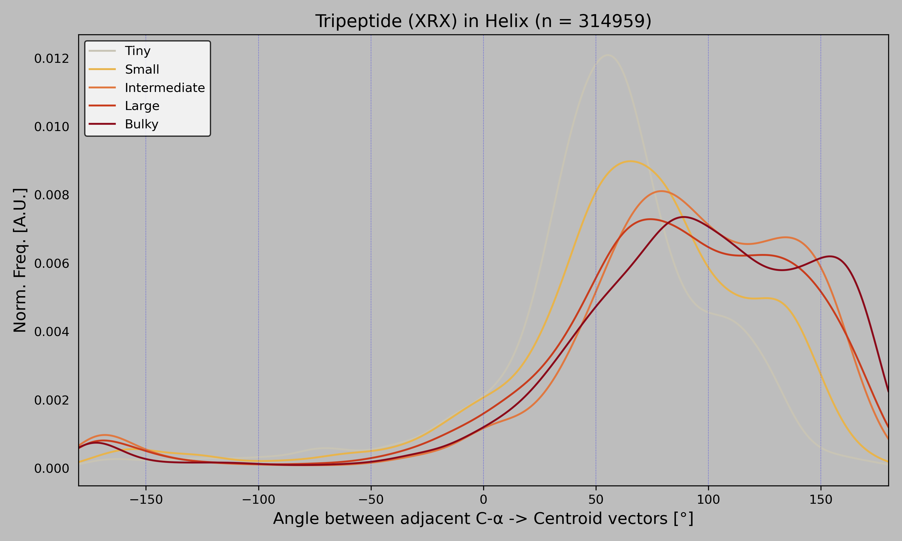

# Tripeptide Angle Analysis

Analysis of signed angles between consecutive Cα→sidechain-centroid vectors for XRX tripeptides in helical regions. Angles are grouped by the size of the left neighbor residue.

## Requirements

- Python 3 with biopython, tqdm, pandas, numpy, scipy, matplotlib
- STRIDE (must be in PATH)
- Snakemake

```
pip install biopython tqdm pandas numpy scipy matplotlib snakemake
```

## Running

Put your `.pdb.gz` files in a folder.

### Full pipeline (snakemake)

```bash
snakemake --cores 4 --keep-going --config target_aa=ARG pdb_dir=/path/to/pdbs
```

This runs all 4 steps: STRIDE → context extraction → angle computation → plotting.


### Run python scripts directly

```bash
# extract contexts from a stride output
python3 scripts/parse_stride.py stride_out/1abc.ss.out contexts/1abc.tsv ARG

# compute angles from all contexts
python3 scripts/calc_angles.py contexts/ final/angles.tsv ARG

# generate plot
python3 scripts/plot_angles.py
```

## Output

- `final/angles.tsv` — all computed angles
- `final/pdb_list.txt` — PDB IDs that contributed data
- `final/angle_plot.png` — density plot


